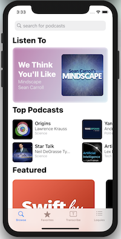
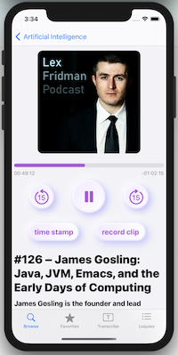
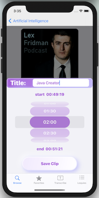
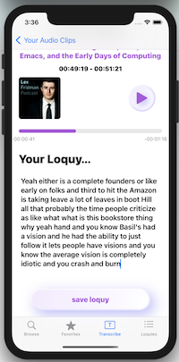
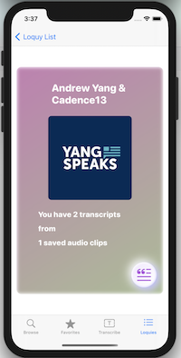
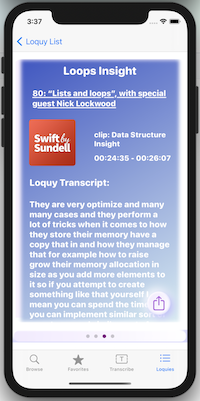

# Loquy Podcasts 

## About
Loquy is a podcast application that allows for users to browse, search, and play their favorite podcasts. By calling on the Apple Music API, a user can find any podcast on Apple. This application was built and designed using SwiftUI, parses XML, and uses MediaPlayer to play podcasts.

One problem that often arises when trying to recall something insightful you might have heard on one of your favorite podcasts is that you might have forgotten when exactly this observation had taken place. Loquy makes it possible for these points in time to be saved as a timestamp so you can easily find it and seek to that specific play time at a later date. 

The main feature of Loquy is what sets it apart from all other available podcast applications. In addition to giving the user functionality that is offered in most other podcast applications, Loquy offers something that doesn't really exist yet. While some other applications allow for clips or snippets to be saved, this application takes it a step further by transcribing the clip they've saved and allowing for the user to save this transcription.

### Future Implementations
- Play podcast in a mini player
- Share transcriptions of audio clips
- Implement a widget for iOS 14

## Technologies Used
Xcode 12, Swift 5, SwiftUI, MediaPlayer, AVFoundation, Combine, CocoaPods, Speech

## Main Player
  

## Transcribing
  

## User Experience
_Browse_ | _Player_ | _Save Clip_
------------ | ------------- | -------------
 |  | 
_Transcribe_ | _Saved Transcriptions_
 | 

## Code Snippets

### Using SFSpeechRecognizer to transcribe audio from a clip
```swift
private func getTranscriptionOfClippedFile() {
        
        SFSpeechRecognizer.requestAuthorization { (authStatus) in
            if let url = AudioTrim.loadUrlFromDiskWith(fileName: audioClip.episode.title + audioClip.startTime + ".m4a") {
                
                AudioTrim.trimUsingComposition(url: url, start: currentTime, duration: audioClip.duration, pathForFile: "trimmedFile") { (result) in
                    switch result {
                    case .success(let clipUrl):
                        print(clipUrl)

                        let request = SFSpeechURLRecognitionRequest(url: clipUrl)

                        speechRecognizer?.recognitionTask(with: request, resultHandler: { (result, error) in
                            if let theError = error {
                                print("recognition error: \(theError)")
                            } else {
                                
                                if playing {
                                    transcription = result?.bestTranscription.formattedString ?? "could not get treanscription"
                                }
                            }
                        })
                    default:
                        print("problem getting clip")
                    }
                }

            }
        }
    }
 ```

### Building a Neumorphic Play/Pause Button view with SwiftUI
```swift

struct NeoButtonView: View {
    var body: some View {
        ZStack {
            Color(#colorLiteral(red: 0.8638685346, green: 0.8565297723, blue: 1, alpha: 1))
            
            Capsule()
                .foregroundColor(.white)
                .blur(radius: 4)
                .offset(x: -8, y: -8)
            Capsule()
                .fill(
                    LinearGradient(gradient: Gradient(colors: [Color(#colorLiteral(red: 0.9536944032, green: 0.9129546285, blue: 1, alpha: 1)), Color.white]), startPoint: .topLeading, endPoint: .bottomTrailing)
                )
                .padding(2)
                .blur(radius: 2)
        }
    }
}

Button(action: {
    playing.toggle()
    playing ? player.play() : player.pause()

}) {
    ZStack {
        NeoButtonView()
        Image(systemName: playing ? "pause.fill" : "play.fill").font(.largeTitle)
            .foregroundColor(.purple)
    }.background(NeoButtonView())
    .frame(width: 80, height: 80)
    .clipShape(Capsule())
    .animation(.spring())
}
.shadow(color: Color(#colorLiteral(red: 0.748958528, green: 0.7358155847, blue: 0.9863374829, alpha: 1)), radius: 8, x: 6, y: 6)
.shadow(color: Color(.white), radius: 10, x: -6, y: -6)
```
